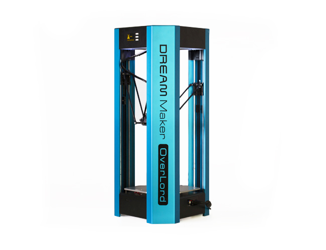

# Overlord Pro Cura Configurations
This repository is for cura and slic3r print profiles and settings for different types of filament for use with the [Overlord Pro](http://www.dreammaker.cc/store/index.php?route=product/product&path=59&product_id=51) by [Dreammaker](http://www.dreammaker.cc/)

All profiles are developments and should be tested before being used.

I'm very interested in others helping developing these profiles please fork the repository and create pull requests with new profiles.

## Submission Guide
File naming convention {__Filament Type__}\_{__Speed__}\_{__Additional Info__}.ini

e.g.

* PLA_Fast_0.4mm.ini

* CopperFill_Fine_ColorFabb-0.14mm.ini

## Current Profiles

* [Cura Overlord Pro Default](cura/default.ini)
* [Slic3r Overlord Pro Default](slic3r/default.ini)